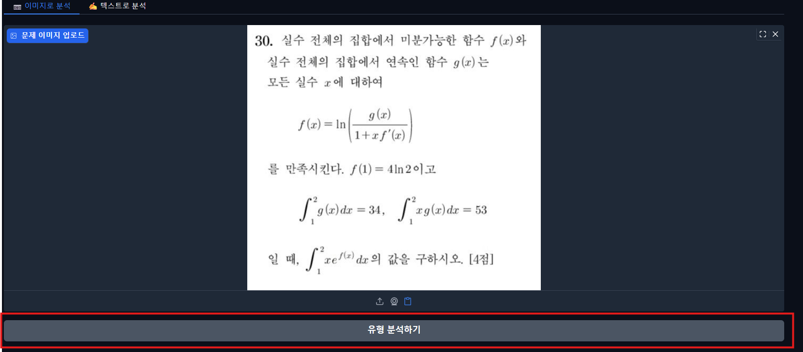

# 📘 수학 문제 분석기 (Math Problem Analyzer)

> **이미지 한 장 또는 텍스트 입력만으로 수학 문제의 단원을 자동 분류하고, 유사한 문제를 추천해주는 Streamlit 기반 웹 애플리케이션**

- ED-project(https://github.com/sonkeehoon/ED-project) 의 일부 모델을 웹 앱으로 구현했습니다

### **웹 앱 구현(결과만 확인하고 싶은 경우)**
- [https://huggingface.co/spaces/santakan/gr-math-genius](https://huggingface.co/spaces/santakan/gr-math-genius)
---


## '이미지로 분석' 실행 과정

### 첫 화면

---
### 1. 이미지 업로드


---
### 2. '유형 분석하기' 버튼 클릭

---
### 3. 문제유형 출력

---
### 4. '문제 추천받기' 버튼 클릭

---
### 5. 해당 문제와 유사한 문제 출력

---
## 🧠 프로젝트 개요

이 애플리케이션은 **수학 문제의 텍스트나 이미지**를 입력받아 다음과 같은 과정을 자동으로 수행합니다:

1. **OCR (Pix2Text)**  
   - 수학 문제 이미지를 인식하여 LaTeX 수식이 포함된 텍스트로 변환합니다.  
   - HuggingFace의 `santakan/Pix2Text-Demo` 모델을 API 형태로 사용합니다.

2. **문제 단원 분류 (Text Classification)**  
   - 미리 학습된 `KLUE-BERT` 기반 분류 모델(`saved_model/`)을 이용해 해당 문제의 단원을 예측합니다.
      - Fine-Tuning 코드 : https://colab.research.google.com/drive/1aitps5USniqeHTok8DYA_BUkZ7TtDIhJ
   - 예: “미분법”, “적분법”, “수열”, “이차곡선” 등

3. **유사 문제 추천 (TF-IDF + Cosine Similarity)**  
   - 동일 단원 내에서 TF-IDF 벡터 유사도를 기반으로 유사한 문제 5개를 추천합니다.

---

## 📂 폴더 구조
```
📦 ED-app
├── app.py           # Streamlit 메인 앱
├── utils.py         # OCR 및 모델 관련 유틸 함수
├── requirements.txt # 의존성 패키지 목록
├── .env             # HuggingFace API 토큰
├── data/
│ ├── 수학시험_데이터_with_category.csv
│ └── tmp.csv
├── saved_model/     # 미리 학습된 모델
└── README.md
```


---

## ⚙️ 설치 및 실행

### 1️⃣ 환경 준비

```bash
git clone https://github.com/sonkeehoon/ED-app.git
cd ED-app
python -m venv venv
source .venv/bin/activate # (Windows : venv\Scripts\activate)
```

### 2️⃣ 의존성 설치
```bash
pip install -r requirements.txt -f https://download.pytorch.org/whl/torch_stable.html
```
- 💡 `-f` 옵션은 CPU 전용 PyTorch(용량 최소화)를 설치하기 위해 필수입니다.

### 3️⃣ 환경 변수 설정

`.env` 파일을 프로젝트 루트에 생성하고 아래와 같이 작성합니다:
```
HF_TOKEN="your_huggingface_access_token"
```
- HuggingFace에 로그인 후 
Access Tokens 페이지
에서 토큰을 발급받을 수 있습니다.

### 4️⃣ 앱 실행
```bash
streamlit run app.py
```
- 웹 브라우저가 자동으로 열립니다
- 기본 URL: `http://localhost:8501`
---
### 💡 주요 기능
### 📷 이미지로 분석

- 클립보드(Win + Shift + S)로 캡처한 이미지를 붙여넣기만 하면 자동으로 텍스트를 인식합니다.

- OCR → 단원 분류 → 유사 문제 추천까지 단계별로 진행됩니다.

### ✍️ 텍스트로 분석

- 직접 수학 문제 텍스트를 입력하면 단원을 예측하고, 비슷한 문제를 추천합니다.

### 🔍 추천 문제 표시

- 문제 정보(연도, 회차, 과목, 번호)와 함께 정답을 확인할 수 있습니다.

- 수식은 LaTeX 포맷을 Streamlit에서 렌더링하여 깔끔하게 표시됩니다.
---
### 🧩 기술 스택
| 영역                    | 기술                                   |
| --------------------- | ------------------------------------ |
| **Frontend**          | Streamlit         |
| **Backend / Logic**   | Python 3.12.3, Numpy, Pandas, Scikit-learn    |
| **NLP Model**         | Transformers (KLUE-BERT fine-tuning) |
| **OCR Engine**        | HuggingFace `santakan/Pix2Text-Demo` |
| **Similarity Search** | TF-IDF + Cosine Similarity           |
| **Environment**       | python-dotenv, tempfile              |
---
### 📊 주요 코드 구성
### 🔹 app.py

- Streamlit UI 및 로직 제어

- 이미지/텍스트 입력 → 분석 → 추천 결과 표시

### 🔹 utils.py

- OCR → 텍스트 변환 (`image_to_text`)

- 분류 모델 로드 및 추론 (`text_to_category, predict`)

- TF-IDF 기반 유사도 계산 (`find_similar_problems`)
---
### 🧪 모델 설명 (`saved_model/`)

- **기반 모델**: `klue/bert-base`

- **학습 데이터**: 수학 기출문제 15개 단원 텍스트

- **입력**: OCR로 인식된 문제 본문

- **출력**: 단원명 (예: "적분법", "수열의 극한" 등)

```python
from utils import text_to_category
label, score = text_to_category("함수 f(x)=x^2+1의 미분계수를 구하시오.")
print(label)  # → '미분법'
```
---
### 🚀 배포 (연구 중)

Docker를 통한 경량 배포 예시:
```dockerfile
FROM python:3.12-slim
WORKDIR /app
COPY . .
RUN pip install -r requirements.txt -f https://download.pytorch.org/whl/torch_stable.html
EXPOSE 8501
CMD ["streamlit", "run", "app.py", "--server.address=0.0.0.0"]
```

```bash
docker build -t math-analyzer .
docker run -p 8501:8501 math-analyzer
```
---
### 🔒 주의사항

- HuggingFace의 Pix2Text-Demo는 **요청 제한(429 Too Many Requests)** 이 발생할 수 있습니다.

- **해결책**: 개인 계정으로 Space를 Duplicate 하여 자체 토큰으로 사용하세요.

- **`.env` 파일은 절대 공개 저장소에 업로드하지 마세요.**
---

### 🏁 License

MIT License © 2025 SKH